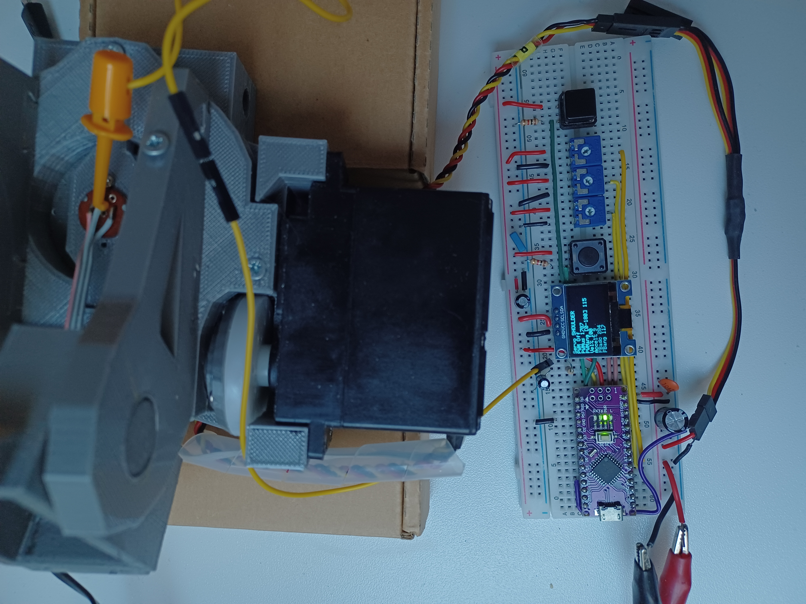

# Arduino Servo Tester

Author: Alejandro Alonso Puig + GPT

License: Apache 2.0 

Repository: https://github.com/aalonsopuig

Status: Validation in progress (March 2026)

---
Servo tester and characterization tool for Arduino Nano.

This project allows testing and calibrating multiple servo configurations using a single hardware setup.  
It is especially useful when working with robots that contain many different servos or mechanical reductions.

The tester supports both **unknown servos** (PWM exploration) and **fully characterized servos** (angular control with limits, speed and acceleration).

This application uses the Enhanced servo library https://github.com/aalonsopuig/Enhanced_Servo_Library

---

## Main Features

- Test **unknown servos** by directly controlling PWM pulse width
- Test **characterized servos** using angle control
- Support for **multiple servo profiles**
- Change active servo configuration with a pushbutton
- Enable / disable PWM safely
- Optional **analog feedback reading**
- OLED display showing operating parameters
- Uses **PROGMEM** to store many servo configurations without exhausting RAM
- Works on **Arduino Nano / ATmega328**

---

## Typical Use Cases

This tool is useful for:

- discovering safe PWM limits of a servo
- verifying servo calibration data
- validating mechanical limits of a joint
- testing servos with gear reductions
- reading analog feedback signals
- tuning speed and acceleration parameters
- validating servo configurations before integrating them in a robot

---

## Hardware

Tested with:

- Arduino Nano
- SSD1306 OLED display (128x64 I2C)
- standard hobby servos
 

### Connections

| Device | Pin |
|------|------|
| Target potentiometer | A2 |
| Speed potentiometer | A1 |
| Acceleration potentiometer | A0 |
| PWM enable button | D4 |
| Next servo button | D3 |
| Servo PWM output | defined in `servo_config.h` |
| Feedback ADC | defined in `servo_config.h` |
| OLED SDA | A4 |
| OLED SCL | A5 |

Buttons must use **external pull-down resistors**.

---

## User Controls

### Target Potentiometer (A2)

Controls the servo position.

Depending on the servo configuration it may represent:

- PWM pulse width
- angular position within allowed limits

 

### Speed Potentiometer (A1)

Controls speed percentage.

Used only when the servo configuration includes speed data.

 

### Acceleration Potentiometer (A0)

Controls acceleration percentage.

Used only when the servo configuration supports motion profiling.

 

### PWM Button (D4)

Toggles PWM output:
- OFF → servo detached
- ON → servo driven

The system always starts with **PWM disabled** for safety.

 

### Next Servo Button (D3)

Cycles through the servo configurations defined in: servo_config.h

When switching servo:

- PWM is automatically disabled
- configuration is reloaded
- the tester is reinitialized

---

## Display Information

The OLED display shows the most relevant parameters depending on the available configuration data.

Typical information includes:

- **Servo**: Name of the currently selected servo profile.

- **PWM**: Indicates whether PWM output to the servo is enabled or disabled.

- **PWMus**: Pulse width in microseconds currently sent to the servo.

- **PWMang**: Commanded servo angle in degrees. Displayed within the allowed motion range.

- **Vel%**: Commanded speed percentage relative to the configured maximum servo speed.

- **Accel%**: Commanded acceleration percentage used by the motion controller.

- **FBadc**: Raw analog value read from the servo feedback pin.

- **FBang**: Estimated servo angle derived from the feedback ADC calibration.

Fields appear only when the corresponding data exists.

---

## Servo Configuration

Servo configurations are defined in: servo_config.h

Each entry describes one servo profile, including:

- **name**: Human-readable identifier of the servo configuration.

- **pwm_pin**: Arduino pin used to generate the PWM signal for the servo.

- **servo_min_deg**: Minimum physical angle of the servo.

- **servo_max_deg**: Maximum physical angle of the servo.

- **allowed_min_deg**: Minimum allowed operating angle for this application.

- **allowed_max_deg**: Maximum allowed operating angle for this application.

- **rest_deg**: Rest or neutral position used for initialization.

- **pwm_min_us**: Pulse width corresponding to the minimum servo position.

- **pwm_max_us**: Pulse width corresponding to the maximum servo position.

- **max_speed_degps**: Maximum servo speed in degrees per second.

- **default_speed_pct**: Default speed percentage used by the controller.

- **default_accel_pct**: Default acceleration percentage used by the controller.

- **feedback_adc_pin**: Analog pin used to read servo position feedback.

- **fb_adc_at_servo_min_deg**: ADC value measured when the servo is at its minimum angle.

- **fb_adc_at_servo_max_deg**: ADC value measured when the servo is at its maximum angle.

- **inverted**: Indicates whether the servo direction must be inverted.

- **fault_detection_enabled**: Enables or disables fault detection logic.

Example:

    {
        "SHOULDER",   // name
        9,            // pwm_pin
        0,            // servo_min_deg
        180,          // servo_max_deg
        0,            // allowed_min_deg
        180,          // allowed_max_deg
        90,           // rest_deg
        700,          // pwm_min_us
        2400,         // pwm_max_us
        17.5f,        // max_speed_degps
        100,          // default_speed_pct
        100,          // default_accel_pct
        3,            // feedback_adc_pin  (A3 on Arduino Nano)
        101,          // fb_adc_at_servo_min_deg
        383,          // fb_adc_at_servo_max_deg
        false,        // inverted
        false         // fault_detection_enabled
    }

---

## Memory Optimization

Servo configurations are stored in PROGMEM (Flash memory) instead of SRAM.

This allows defining many servo profiles without exhausting RAM. Memory Optimization

Servo configurations are stored in PROGMEM (Flash memory) instead of SRAM.

This allows defining many servo profiles without exhausting RAM.